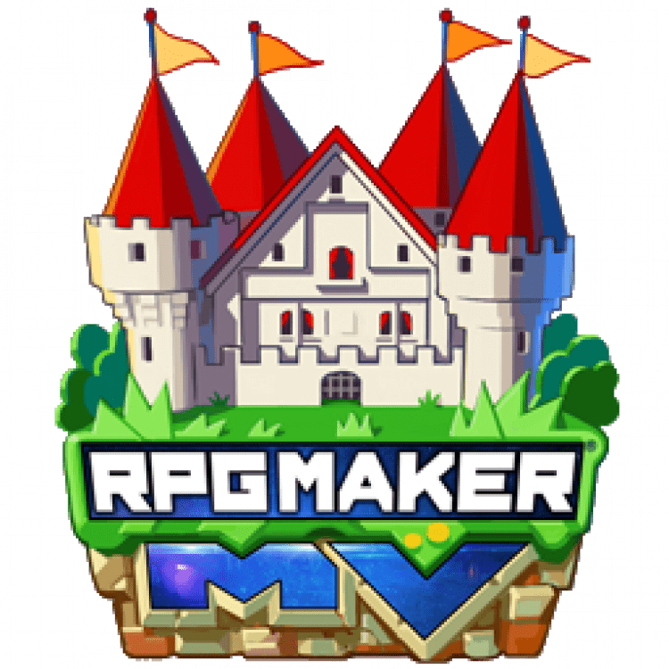

<h1 align="center">Turning Thoughts into Code Since 2019</h1>

###

###

  
  
  
  

###

My name is Yuri and I'm a developer from Rio de Janeiro,Brazil. 

I am a Junior Developer / Programmer (⭐) with experience in website creation, REST API development, and game development. I am always looking to improve my skills by participating in coding challenges, tech events, and cybersecurity activities.

<h3 align="left">🧑‍💻 Programming Languages</h3>

  
  
  
  
  
  
  
  
  
  

<h3 align="left">🚀 Technologies & Frameworks</h3>

  
  
  
  
  
  
  
  

<h3 align="left">🛠️ Tools</h3>

  
  
  
  
  
  
  
  
  
  
  
  

###

<h1 align="center"></h1>

  
  

###

###

  

###
